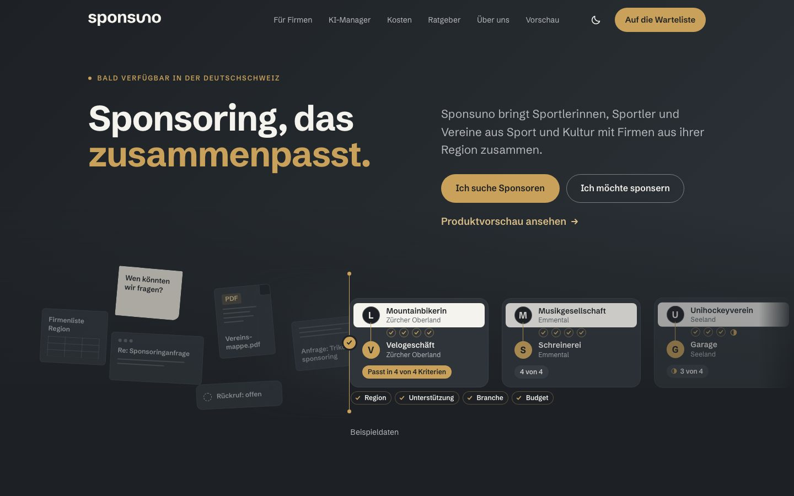
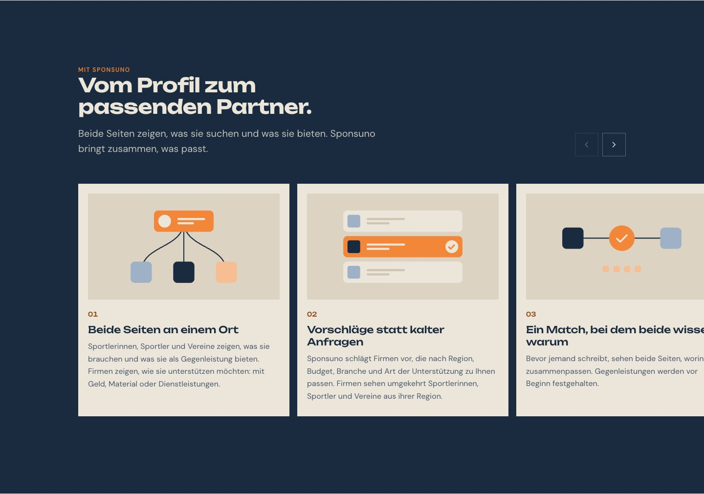
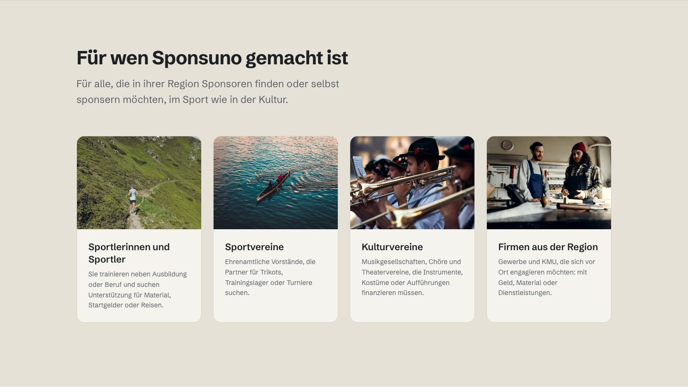
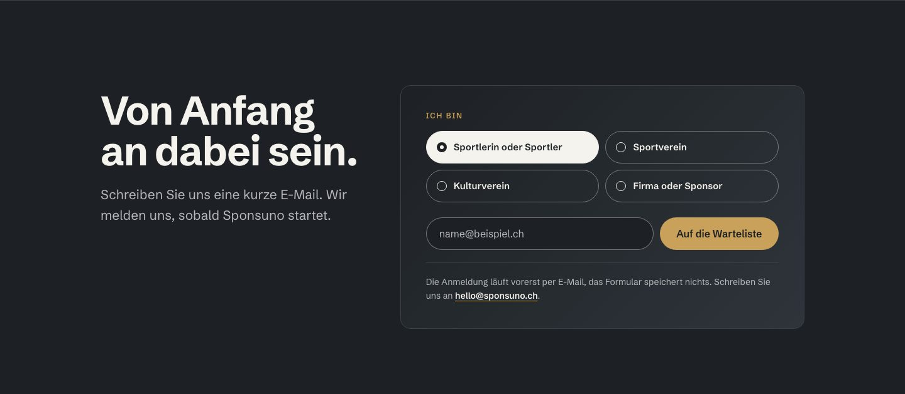
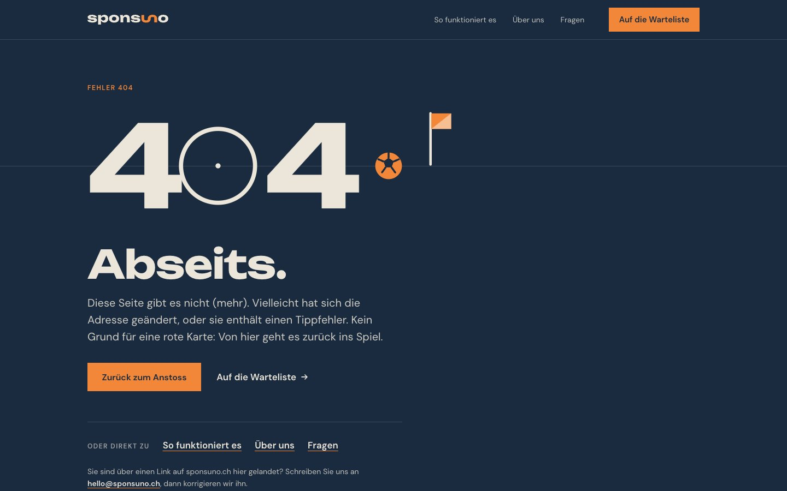
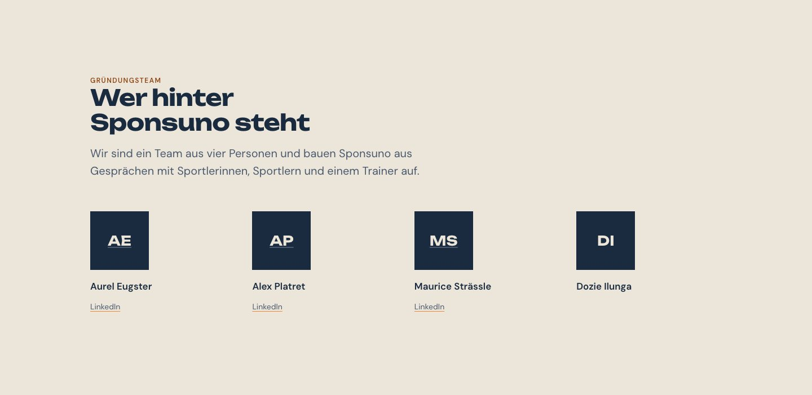
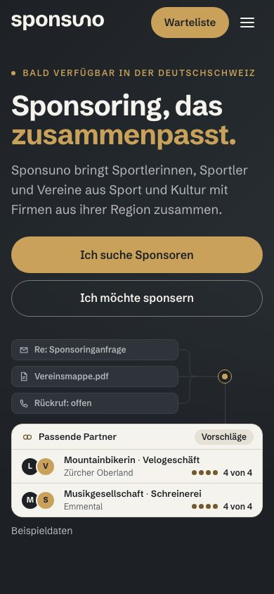
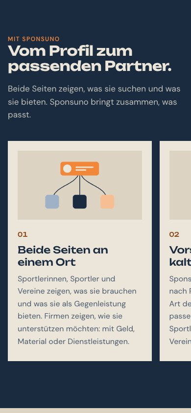
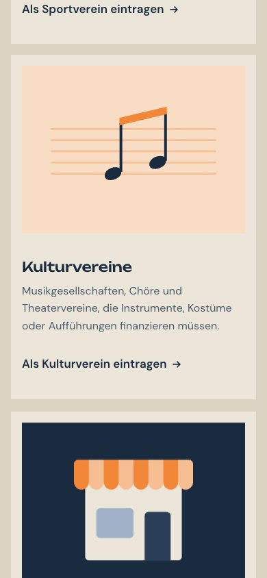
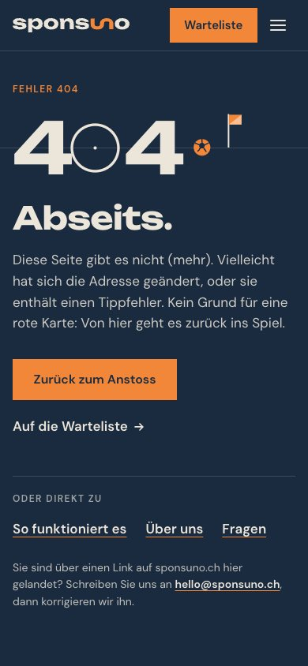

<p align="center">
  <a href="https://sponsuno.ch">
    
  </a>
</p>

<p align="center">
  <a href="https://sponsuno.ch"></a>
  
  
</p>
<p align="center">
  
  
  
  
  
</p>

<p align="center">
  <b>Sponsuno bringt Sportlerinnen und Sportler, Sport- und Kulturvereine mit Firmen aus ihrer Region zusammen.</b><br>
  Ein persönlicher KI-Sponsoringmanager soll danach bei Anfragen, Terminen und Gegenleistungen helfen.<br>
  Das ist die Startseite dazu: ein Projekt im Youngpreneurs-Programm.
</p>

<p align="center">
  <a href="https://sponsuno.ch"><b>Live ansehen</b></a>
  &nbsp;&nbsp;|&nbsp;&nbsp;
  <a href="#was-drin-steckt">Was drin steckt</a>
  &nbsp;&nbsp;|&nbsp;&nbsp;
  <a href="#technik">Technik</a>
  &nbsp;&nbsp;|&nbsp;&nbsp;
  <a href="#design-system">Design-System</a>
  &nbsp;&nbsp;|&nbsp;&nbsp;
  <a href="#lokal-starten">Lokal starten</a>
</p>

<br>

## Was drin steckt

Eine Startseite, die alles zeigt: Hero mit ruhigem Punktefeld, eine klare Aussage, «Heute», «Mit Sponsuno» (vier Schritte zum Durchblättern), «Für wen», das Team, häufige Fragen und die Warteliste mit Double-Opt-in über Brevo. Dazu Impressum, Datenschutz, eine eigene 404-Seite und die Bestätigungsseite der Warteliste. Die früheren Themenseiten (Kosten, Fragen, Über uns) sind geparkt und leiten auf die Startseite.

<table>
  <tr>
    <td width="50%"><br><sub>«Mit Sponsuno»: vier Schritte mit Zeichnungen, seitlich zu blättern</sub></td>
    <td width="50%"><br><sub>«Für wen»: vier Gruppen, je mit eigener Zeichnung</sub></td>
  </tr>
  <tr>
    <td width="50%"><br><sub>Warteliste auf Tintenblau</sub></td>
    <td width="50%"><br><sub>404: «Abseits.»</sub></td>
  </tr>
  <tr>
    <td width="50%"><br><sub>Gründungsteam</sub></td>
    <td width="50%"></td>
  </tr>
</table>

### Auf dem Handy

<table>
  <tr>
    <td align="center" width="25%"><br><sub>Hero</sub></td>
    <td align="center" width="25%"><br><sub>Mit Sponsuno</sub></td>
    <td align="center" width="25%"><br><sub>Für wen</sub></td>
    <td align="center" width="25%"><br><sub>404</sub></td>
  </tr>
</table>

<br>

## Technik

Vite 8, React 19 und TypeScript im Strict-Modus, ohne UI- oder CSS-Framework. Jede Seite wird beim Build vorgerendert; Rechtsseiten und 404 laden kein JavaScript. Das Punktefeld im Hero ist ein kleiner WebGL-Shader, der erst nach dem Laden startet und pausiert werden kann. Die Zeichnungen sind reines SVG; [Motion](https://motion.dev) zeichnet sie beim Scrollen ein und wird erst nachgeladen, damit der erste Seitenaufruf schlank bleibt (rund 86 KB JavaScript, gzip). Icons von [Lucide](https://lucide.dev). Wer «Bewegung reduzieren» eingestellt hat, sieht alles sofort im Endzustand. Alle Texte stehen typisiert in [`src/content.ts`](src/content.ts). Details, Budgets und Regeln: [AGENTS.md](AGENTS.md).

<br>

## Design-System

Alles folgt dem Markenhandbuch «Entwurf D1»: Tintenblau trägt (60 %), Hafer gibt Raum (30 %), Bernstein setzt den Akzent (10 %), pro Titel höchstens ein Wort in Bernstein. Eckige Formen, Spielfeldlinien als ruhiges Motiv.

<p>
  
  
  
  
  
  
</p>

| Rolle | Schrift |
| --- | --- |
| Titel | **Unbounded** 700, Zwischentitel 500 |
| Fliesstext, Buttons, Labels | **DM Sans** 400 und 600; Labels in Versalien |

Die Wortmarke «sponsuno»: u und n werden zu einer geometrisch gezeichneten Schlaufe in Bernstein, als Vektor in jeder Grösse scharf ([`scripts/logo.mjs`](scripts/logo.mjs)). Die Schlaufe allein ist Favicon und App-Icon. Die Zeichnungen folgen einem eigenen kleinen System (4er-Raster, zwei Linienstärken, Bernstein nur für das Wesentliche). Texte in Hochdeutsch mit Schweizer Schreibweise, sachlich und ohne Werbefloskeln. Was noch nicht entschieden ist, steht als offen da. Einzelheiten: [DESIGN.md](DESIGN.md).

<br>

## Lokal starten

Node 22.18 oder neuer (wie in `package.json`).

```bash
git clone https://github.com/platret/sponsuno.git
cd sponsuno
npm install
npm run dev
```

Dann http://localhost:5173/ öffnen. Weitere Befehle: `npm run build` (Typprüfung, Build und Vorrendern nach `dist/`), `npm run preview` (den Build lokal ansehen), `npm run typecheck`.

```
sponsuno/
├── index.html              Vite-Einstieg, Schriften, Meta-Tags
├── 404.html                Seite für unbekannte Adressen, vorgerendert
├── impressum/index.html    Impressum (/impressum/), vorgerendert, ohne JavaScript
├── datenschutz/index.html  Datenschutzerklärung (/datenschutz/), vorgerendert, ohne JavaScript
├── kosten/ …               Geparkte Themenseiten (nicht gebaut; die alten Adressen leiten auf die Startseite)
├── warteliste/bestaetigt/  Seite nach der Bestätigung der Warteliste (noindex)
├── src/
│   ├── App.tsx             Reihenfolge der Abschnitte, Scrollen, Anker-Links
│   ├── content.ts          Alle Texte der Seite, typisiert
│   ├── pages.ts            Alle Seiten mit Titel und Beschreibung (Head-Tags, Sitemap)
│   ├── components/         Ein Bauteil pro Abschnitt, dazu Header, Menü, Zeichnungen (featuresArt, audienceArt)
│   ├── lib/                heroField.ts (Punktefeld), motion.ts, links.ts; templates.ts nur für die geparkten Ratgeber
│   ├── styles/             tokens.css (Design-Tokens aus dem CD), site.css, sections/ (ein Stylesheet pro Abschnitt)
│   └── assets/             Logos, Wortmarken, Schriften; Stockfotos (photos/) derzeit nicht im Einsatz
├── worker/                 Cloudflare Worker, nur für /api/* (Warteliste)
├── emails/                 E-Mails der Warteliste (npm run emails, Anleitung im README dort)
├── public/                 Icons, robots.txt, _headers (Cache und Sicherheit), _redirects (301 der geparkten Seiten)
├── scripts/prerender.mjs   Vorrendern beim Build, Head-Tags und sitemap.xml
├── scripts/og/, icons.mjs  Quellen für Vorschaubild und Icons in public/
├── .github/workflows/      Vorschau bei Pull Requests, Deploy von main (Cloudflare)
├── wrangler.jsonc          Cloudflare Worker: Domains und Assets
├── AGENTS.md               Regeln und Architektur für jede Session
├── DESIGN.md               Farben, Schrift, Komponenten, Bewegung
└── docs/                   Bilder für dieses README
```

Deploy: Jeder Push auf `main` baut die Seite und veröffentlicht sie über Cloudflare Workers auf https://sponsuno.ch. Pull Requests bekommen eine Vorschau-URL. Details in [AGENTS.md](AGENTS.md#deploy).

<br>

## Vor dem Launch

Die aktuelle Liste steht in [AGENTS.md → Open before launch](AGENTS.md#open-before-launch): Provisionsmodell, Namens- und Markenprüfung, E-Mails und Vorschaubild im neuen Look, eigene Fotos.

<br>

## Mitarbeiten

Bevor du etwas änderst: [AGENTS.md](AGENTS.md) (Architektur, Regeln für Texte, Leistung, Barrierefreiheit, Deploy) und [DESIGN.md](DESIGN.md) (Farben, Schrift, Komponenten, Bewegung). Beide gelten für Menschen und KI-Sessions gleichermassen.

<br>

<p align="center">
  
</p>
<p align="center">
  <sub>Team Sponsuno · Youngpreneurs-Programm · Start in der Deutschschweiz</sub>
</p>
